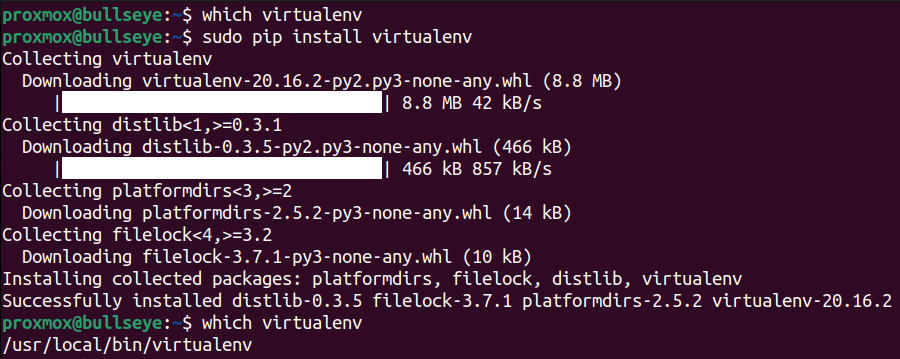
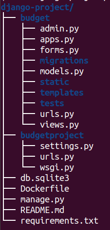

# Django Project

The purpose of this project is to build a CI/CD pipeline for a django project.  
Here is the original [link](https://github.com/TheDumbfounds/django-testing-tutorial/tree/master/budgetproject)
of the project we'll be working on.

As a devops engineer, our job is not to write the code of this application.
Instead, we'll automate the integration of the code, build, test, release and 
deploy the application.

We'll be using two virtuals machines: a webserver to deploy django application
and gitlab runner server. Follow this [link](https://gitlab.com/devopsity/gitlab-runner)
to install gitlab runner on a virtual machine.

## Prerequisites

1. Gitlab runner server
    - [Docker](https://docs.docker.com/engine/install/ubuntu/)
    - python (pre-installed on linux)
    - pip (`sudo apt install -y python3-pip`)
    - virtualenv

2. Webserver
    - Docker
3. Make sure you can connect to webserver from gitlab runner server using ssh protocol.

## Django project structure

## Pipeline

### Build stage

- Use virtualenv to build python environment: `virtualenv WORKDIR/venv`
- Activate the environment: `source venv/bin/activate`
- Install requirements: `pip install -r requirements.txt`

### Test stage

- Run tests: `python manage.py test app_name`
- Check the server:
    - `nohup python manage.py runserver &`
    - `sleep(10)`
    - `curl -sSf http://localhost:8080 > /dev/null && echo "Up" | grep "Up"`
    - `pkill python`
    - `rm nohup.out`

### Release stage

- Login to Gitlab registry: `docker login -u $CI_REGISTRY_USER -p $CI_REGISTRY_PASSWORD $CI_REGISTRY`
- Build docker image: `docker build -t $CONTAINER_IMAGE .`
- Push image to Gitlab registry: `docker push $CONTAINER_IMAGE`
- Logout: `docker logout`

### Deploy

- Connect to webserver and run docker container: `ssh -o StrictHostKeyChecking=no -i $SSH_KEY user@webserver_ip docker run -d -p 8000:8000 $CONTAINER_IMAGE`